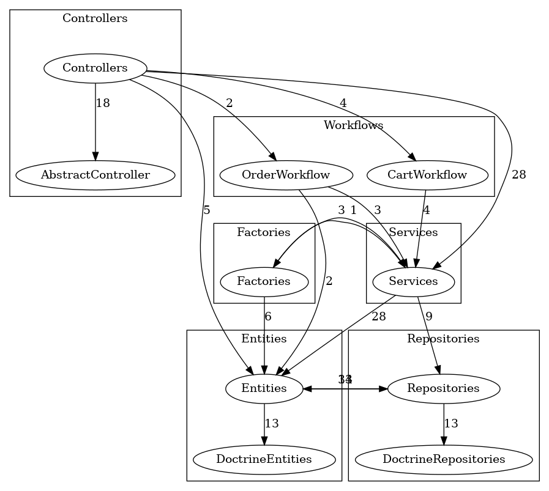

# Shop app with cart

static analysis:

[](https://github.com/RafalSalwa/interview-client-php/actions/workflows/psalm.yml)
[](https://shepherd.dev/github/rafalsalwa/shop)
[](https://github.com/RafalSalwa/interview-client-php/actions/workflows/phpstan.yml)
[](https://github.com/RafalSalwa/interview-client-php/actions/workflows/phpmd.yml)

Code analysis:

[](https://github.com/RafalSalwa/interview-client-php/actions/workflows/phpcs.yml)
[](https://github.com/RafalSalwa/Shop/actions/workflows/php-cs-fixer.yml)
[](https://github.com/RafalSalwa/Shop/actions/workflows/rector.yaml)

Architecture:

[](https://github.com/RafalSalwa/interview-client-php/actions/workflows/architecture_dependencies.yml)

External services

[](https://jenkins.salwa.com.pl/job/Shop/)
[](https://app.fossa.com/projects/git%2Bgithub.com%2FRafalSalwa%2Finterview-client-php?ref=badge_shield&issueType=license)
[](https://codecov.io/gh/RafalSalwa/interview-client-php)

Codacy:
[](https://app.codacy.com/gh/RafalSalwa/interview-client-php/dashboard?utm_source=gh&utm_medium=referral&utm_content=&utm_campaign=Badge_grade)
[](https://app.codacy.com/gh/RafalSalwa/interview-client-php/dashboard?utm_source=gh&utm_medium=referral&utm_content=&utm_campaign=Badge_coverage)


SonarQube: [](https://sonarcloud.io/summary/new_code?id=RafalSalwa_Shop)
[](https://sonarcloud.io/summary/new_code?id=RafalSalwa_Shop)
[](https://sonarcloud.io/summary/new_code?id=RafalSalwa_Shop)
[](https://sonarcloud.io/summary/new_code?id=RafalSalwa_Shop)
[](https://sonarcloud.io/summary/new_code?id=RafalSalwa_Shop)
[](https://sonarcloud.io/summary/new_code?id=RafalSalwa_Shop)

---

Simple and feature rich Shopping cart based on PHP 8.2, Symfony 6, PostgresSQL, OAuth2, gRPC and custom [grpc&REST Auth api](https://github.com/RafalSalwa/auth-api)

Featured with Shopping cart, profile management, Order processing flow with abandoned carts and pendings. Features based on subscription tiers.

## ⚙️ Installation
```bash
make up
```
or via symfony internal server installed on host:
```bash
make local
```

then You can visit [http://127.0.0.1:8001/](http://127.0.0.1:8001/)

Also, there is a openApi documentation at [http://127.0.0.1:8001/doc](http://127.0.0.1:8001/doc) or postman collection is in [docs](docs/RSShop.postman_collection.json) folder

## 🎯 Features
- Products listings based on subscription tier
- Flow control with Symfony Workflows and Security Voters
- cart management via view or REST Api
- REST communication with Auth-api via JWT Tokens for authentication flow in User Providers and Authenticators
- OAuth2 server integration for authorization flow
- Doctrine entities with Inheritance pattern and abstraction for cart and order items
- GitHub actions, Jenkins, Gitlab integrations
- gRPC clients for external (golang) [Auth-api](https://github.com/RafalSalwa/auth-api)
- Clean layered architecture checked by [PHPArkitect and deptrac](.github/workflows/architecture_dependencies.yml)
- Static analysis with [PHPStan lvl 7](.github/workflows/phpstan.yml), [Psalm lvl 2](.github/workflows/psalm.yml), [PHPMD](.github/workflows/phpmd.yml), [PHPCS](.github/workflows/phpcs.yml), [PHP-CS-Fixer](.github/workflows/php-cs-fixer.yml), [Rector](.github/workflows/rector.yaml)
- External tools for quality analysis PHPMetrics, PHPInsights, Snyk, SemGrep, SonarQube, Codacy & codecov


## Screenshots:



