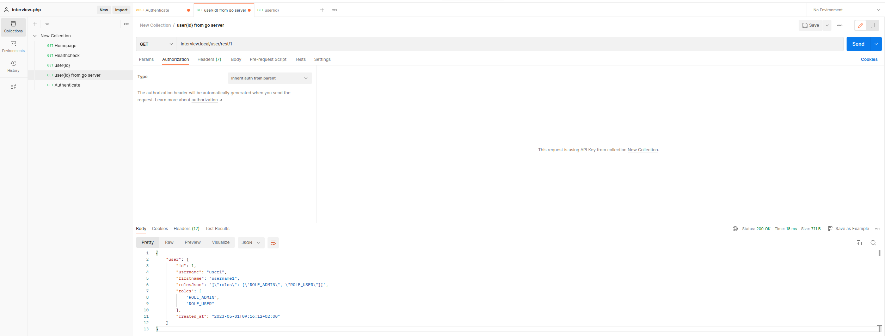
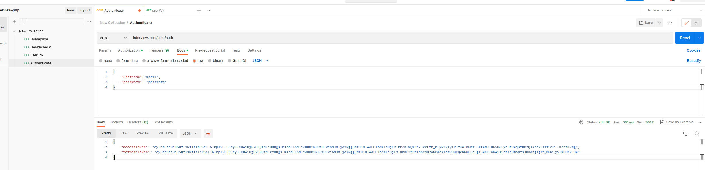

# interview-client-php

simple REST Server with REST and gRPC clients to communicate with go  [grpc&REST interview server](https://github.com/RafalSalwa/interview-app-srv)
# Build
At first create docker network if You did not do so for server
```bash
docker network create --driver=bridge --subnet=172.28.1.0/24 --ip-range=172.28.1.0/24 --gateway=172.28.5.254 external-interview-net
```
next steps are to build docker
```bash
make compose-up
```
add hosts entry for nginx vhost
```bash
echo "0.0.0.0  interview.local" >> /etc/hosts
```
postman collection is in docs folder

## Screenshots:



